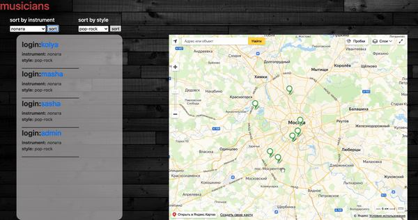

# Musicians

Сервис для поиска музыкантов по геопозиции.

Данный сервис может быть полезен для музыкантах играющих в группах или звукорежиссерам.

### Интерфейс:

Мызыкант регистрируется, вводит свой адрес, инструмент, которым владеет и музыкальный стиль в котором он играет.
Далее он может найти людей поблизости и собрать с ними музыкальнный коллектив, найти музыканта под разовое мероприятие или для записи музыкальной партии.

Запуск программы: 
> npm i

> npm start

Используемые технологии: HTML, CSS, Bootstrap Node js, Express, Mongoose, Yandex API и другие.

